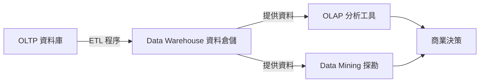

# 05 Advanced Systems 完整題目解析 - 申論題答題框架

這份文件針對**05 Advanced Systems**相關題目提供詳盡的申論題答題架構。

---

## 📊 題目總覽

根據分析，在歷年資料庫應用考題中：

### 題目統計

| 統計項目 | 數量 |
|---------|------|
| **分析考卷總數** | **74 份** |
| **05 Advanced Systems相關題目** | **18 題** |
| **114年題目** | 2 題 |
| **重要性排名** | **No. 5 (趨勢熱點)** |

### 題型分類

| 題型 | 占比 | 代表題目 | 難度 |
|------|------|---------|------|
| **NoSQL資料庫** | 35% | CAP定理、Key-Value/Document | ⭐⭐⭐⭐⭐ |
| **大數據技術** | 30% | Hadoop, Spark, MapReduce | ⭐⭐⭐⭐ |
| **資料倉儲/探勘** | 25% | OLAP, ETL, Data Mining | ⭐⭐⭐ |
| **分散式系統** | 10% | 分散式交易、複製 | ⭐⭐⭐⭐ |

**難度星級說明**:
- ⭐⭐⭐ = 基礎必考
- ⭐⭐⭐⭐ = 進階重要
- ⭐⭐⭐⭐⭐ = 新興熱門 (近三年大量出現)

---

## 🎯 申論題答題黃金架構

### 1. 比較題型 (例如：SQL vs NoSQL)

> **一、核心差異**
> (一句話破題：關聯式強調一致性 (ACID)，NoSQL 強調擴充性與靈活度 (BASE))
>
> **二、多面向比較 (表格)**
> (比較項目：資料模型、綱要 (Schema)、擴充性 (Scaling)、交易特性、適用場景)
>
> **三、CAP 定理應用**
> (引入 CAP 理論，說明兩者在 C、A、P 之間的取捨)

### 2. 名詞解釋與生態系題型 (例如：解釋 Data Warehouse)

> **一、定義**
> (清楚定義該名詞的核心功能)
>
> **二、關鍵特性**
> (列點說明其技術特徵，例如：主題導向、整合性、非揮發性、隨時間變化)
>
> **三、與相關技術的關係**
> (畫出架構圖或流程圖，例如：OLTP -> ETL -> Data Warehouse -> OLAP -> Data Mining)

---


---

## 📚 【核心知識】完全解析


---

## 📝 實戰解析：精選題型詳解

### 【題型一】SQL vs NoSQL 綜合比較

#### 📌 原題：113年調查局三等

> **題目**：
> SQL 資料庫和 NoSQL 資料庫做比較，就資料模型的靈活性、資料庫的可擴展性、資料庫的可用性、資料的一致性和完整性、查詢效率、維護性等六方面，敘述優缺點並申論之。

#### 💡 解析與擬答

這是一道非常標準且完整的比較題，答題時建議使用表格搭配文字說明。

| 比較面向 | SQL (關聯式資料庫) | NoSQL (非關聯式資料庫) |
| :--- | :--- | :--- |
| **1. 資料模型靈活性** | **低 (Schema-on-Write)** <br> 需預先定義嚴謹的 Schema，變更欄位困難。 | **高 (Schema-on-Read)** <br> 無固定 Schema (Schemaless)，可隨時新增欄位，適合非結構化資料。 |
| **2. 可擴展性** | **垂直擴充 (Scale-up)** <br> 升級單機硬體 (CPU, RAM)，有物理極限且昂貴。 | **水平擴充 (Scale-out)** <br> 透過增加伺服器節點來擴充，成本低且彈性大。 |
| **3. 可用性 (Availability)** | **較低** <br> 為了維持強一致性 (ACID)，在分區容錯發生時可能需犧牲可用性。 | **極高** <br> 遵循 BASE 理論，允許最終一致性，優先保證系統隨時可用。 |
| **4. 一致性與完整性** | **強一致性 (ACID)** <br> 支援交易管理，確保資料隨時正確，有完善的關聯鍵約束 (FK)。 | **最終一致性 (BASE)** <br> 放寬一致性要求，通常不支援跨文件的交易與關聯約束。 |
| **5. 查詢效率** | **複雜查詢強** <br> 擅長 JOIN、聚合等多表關聯查詢。 | **簡單查詢快** <br> Key-Value 查詢極快，但不擅長複雜關聯 (JOIN)。 |
| **6. 維護性** | **成熟穩定** <br> 工具豐富，人才多，但分片 (Sharding) 維護複雜。 | **百家爭鳴** <br> 技術迭代快，各家實作差異大，維護門檻較高。 |

**結論**：
SQL 適合金融、會計等對資料正確性要求極高的核心系統；NoSQL 適合社群媒體、物聯網 (IoT) 等資料量大且格式多變的應用。

---

### 【題型二】NoSQL 資料模型設計 (JSON)

#### 📌 原題：109年外交領事四等

> **題目**：
> 請將下列的關聯式資料集改以 JSON 格式儲存。
> (給定一個包含 id, author, announcement, Create_time 的表格資料)

#### 💡 解析與擬答

JSON (JavaScript Object Notation) 是 NoSQL (特別是 Document Store 如 MongoDB) 最常用的資料格式。

**轉換原則**：

1. 每一列 (Row) 轉換為一個 **物件 (Object)** `{ ... }`。
2. 欄位名稱變為 **鍵 (Key)**，欄位值變為 **值 (Value)**。
3. 多筆資料組合成一個 **陣列 (Array)** `[ ... ]`。
4. 字串需加引號，數字與布林值不用。

**擬答**：

```json
[
  {
    "id": 238,
    "author": "Bill",
    "announcement": "國際環保遵行規定",
    "Create_time": "2020/08/15"
  },
  {
    "id": 256,
    "author": "Jane",
    "announcement": "文化資產保存",
    "Create_time": "2020/08/18"
  }
]
```

> **進階技巧**：如果題目涉及「一對多」關係 (例如一位作者有多篇文章)，在 NoSQL 中常使用 **嵌入 (Embedding)** 方式設計，將文章列表直接放在作者物件內，而非像 SQL 那樣拆成兩張表。

---

### 【題型三】大數據生態系 (Data Warehouse, OLAP, ETL)

#### 📌 原題：108年關務三等

> **題目**：
> 說明 Data Warehouse, Data Mining, OLTP, OLAP, ETL 的主要功用及其相互運作關係。

#### 💡 解析與擬答

這題考驗對資料處理流程的整體觀。

**一、名詞定義**

1. **OLTP (Online Transaction Processing)**：線上交易處理。負責日常營運資料的**新增、修改、刪除**，強調交易速度與 ACID (如：銀行轉帳)。
2. **ETL (Extract, Transform, Load)**：擷取、轉換、載入。負責將資料從 OLTP 系統抽出，清洗轉換格式後，載入到資料倉儲。
3. **Data Warehouse (資料倉儲)**：支援決策分析的資料集合。特性為**主題導向、整合性、非揮發性、隨時間變化**。
4. **OLAP (Online Analytical Processing)**：線上分析處理。針對倉儲資料進行多維度分析 (切片、切塊、鑽取)，支援複雜查詢。
5. **Data Mining (資料探勘)**：從大量資料中自動發現隱藏的模式、關聯或趨勢 (如：啤酒與尿布的關聯)。

**二、相互運作關係 (建議畫圖)**



**運作流程說明**：
企業日常營運產生大量交易資料 (**OLTP**)，透過 **ETL** 工具定期清洗並彙整至 **Data Warehouse** 儲存。決策者利用 **OLAP** 進行多維度報表分析，或利用 **Data Mining** 挖掘潛在商機，最終輔助商業決策。

---

### 【題型四】分散式資料庫 vs 集中式資料庫

#### 📌 原題：113年一般警察三等

> **題目**：
> 闡述分散式資料庫與集中式資料庫的特點與各自的優缺點。

#### 💡 解析與擬答

**一、集中式資料庫 (Centralized DB)**

- **特點**：所有資料與處理邏輯都集中在單一站點 (Site)。
- **優點**：管理簡單、資料一致性容易維護、安全性控管容易。
- **缺點**：單點故障 (Single Point of Failure)、擴充性受限、遠端存取效能差。

**二、分散式資料庫 (Distributed DB)**

- **特點**：資料邏輯上屬於同一系統，但實體上分散在透過網路連結的多個站點。
- **優點**：
    1. **高可靠性**：單一站點故障不影響整體運作。
    2. **高效能**：資料可就近存取 (Data Locality)，且支援平行處理。
    3. **高擴充性**：可隨時加入新節點。
- **缺點**：
    1. **軟體複雜**：需處理分散式交易 (2PC)、死結偵測、複本一致性。
    2. **開發成本高**：需維護資料透明性 (Transparency)。

---


---

## 📖 歷屆考題彙整連結

請參閱同目錄下的 `05_Advanced_Systems.md` 檔案以查看完整歷屆考題。
